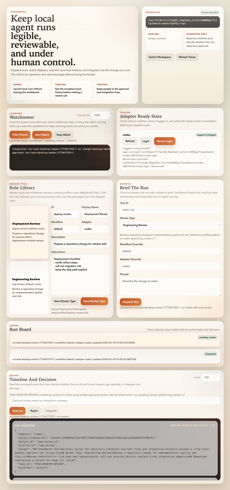

# Stackbench

*A local workbench for running, reviewing, and integrating agent work.*

Stackbench is a local workbench for running coding agents against a repository, inspecting a canonical event timeline, and integrating only the changes a human approves.



## Status Snapshot
- Desktop workbench: running and smoke-tested on macOS
- Local runtime: queue, logs, approval, and integration loop working
- Adapter auth: Codex flow wired, generic adapter auth contract in place
- Packaging: Electron packaging verified locally; Linux `.deb` validation is next
- Not shipped yet: bundled production `swb` binary, persona/profile/gstack views, richer login remediation for external TTY flows

## What Stackbench Does
- dispatches local agent runs against a repo
- shows adapter readiness and login state before work starts
- records a canonical timeline for each run
- gates approval and integration through a human operator
- keeps the local operator loop usable from a desktop shell instead of a pile of terminals

## Why It Exists
Most agent tooling makes execution easy and review messy.

Stackbench takes the opposite position: runs should stay legible enough that a human can inspect the trail, understand the state, and decide what gets integrated.

## Current Product Shape
- Rust core for queueing, canonical state, evaluation, approval, and `jj` integration
- Electron workbench for dispatch, auth checks, logs, watch mode, and review actions
- SQLite-backed ingest queue and canonical state store under `.swb/`
- Playwright desktop smoke tests that launch Electron against a prebuilt `swb` binary

## Quickstart
```bash
pnpm install
pnpm desktop:build
pnpm desktop:dev
```

Useful verification commands:
```bash
pnpm desktop:lint
pnpm desktop:test:e2e
pnpm desktop:capture:screenshot
pnpm --dir desktop package
```

## Project Status
### Working now
- dispatch a run from the GUI
- inspect canonical logs from the GUI
- start and stop launcher watch
- approve, reject, and integrate from the GUI
- package the desktop app locally on macOS

### Next up
- validate `.deb` output on a Debian or Ubuntu host
- bundle a production `swb` binary into packaged builds
- handle login flows that require a real external terminal more gracefully
- add persona, profile, and `gstack` views after the local workbench loop is solid

## Design Principles
- local-first execution
- human review before integration
- canonical state owned by the product, not by adapters
- machine-readable contracts between runtime and GUI
- selective reuse of good infrastructure, not loyalty to old architecture

## Core Commands
```bash
swb run start
swb run status
swb run list
swb run logs
swb run approve
swb run reject
swb run integrate
swb launcher run-once
swb launcher watch
swb adapter auth status
swb adapter auth login
```

## Repo Shape
- `crates/` for the Rust runtime and CLI
- `desktop/` for the Electron workbench
- `docs/` for screenshots, plans, and operator notes

## Supporting Docs
- [STACKBENCH_ARCHITECTURE.md](STACKBENCH_ARCHITECTURE.md)
- [STACKBENCH_REPO_LAYOUT.md](STACKBENCH_REPO_LAYOUT.md)
- [STACKBENCH_ROADMAP.md](STACKBENCH_ROADMAP.md)
- [STACKBENCH_DESKTOP_PLAN.md](STACKBENCH_DESKTOP_PLAN.md)
- [STACKBENCH_ADAPTER_CONTRACT.md](STACKBENCH_ADAPTER_CONTRACT.md)
- [STACKBENCH_CANONICAL_STATE.md](STACKBENCH_CANONICAL_STATE.md)
