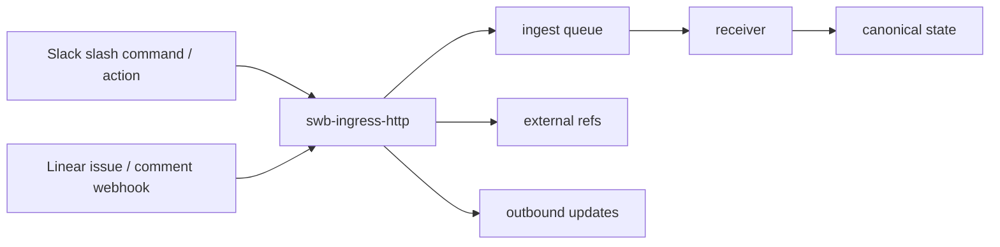

# Stackbench - Ingress Spec

Date: 2026-03-16
Status: Active
Depends on: `STACKBENCH_ARCHITECTURE.md`, `STACKBENCH_CANONICAL_STATE.md`, `STACKBENCH_PERSONA_PROFILE_MAPPING.md`, `STACKBENCH_ADAPTER_CONTRACT.md`

## Purpose
Define how Slack and Linear ingress connect to Stackbench without becoming a second source of truth.

## Ownership Rules
- Slack and Linear are ingress and notification surfaces only.
- Stackbench owns canonical run state, evaluation state, approval state, and integration state.
- Ingress handlers may persist additive metadata such as external refs and outbound update records.
- Ingress handlers must not invent a second lifecycle outside the queue -> receiver -> projector path.

## Current Implemented Slice
- `swb-ingress-http` exposes:
  - `GET /health`
  - `POST /ingress/slack/command`
  - `POST /ingress/slack/action`
  - `POST /ingress/linear/webhook`
- `swb ingress serve --listen <ADDR>` starts the local HTTP ingress service.
- personas are repo-local TOML files under `swb/personas/<ingress>/`.
- inbound requests resolve to the same `swb run start`-style run request contract used by CLI and desktop dispatch.
- accepted ingress requests queue a canonical `run_requested` envelope, drain through the receiver, and store:
  - external reference mappings
  - queued outbound status updates

## Canonical Ingress Flow

## External Mapping Model
Current additive state records:

### External Ref
- `system`
- `entity_kind`
- `external_id`
- `task_id?`
- `run_id?`
- `persona_id?`
- `title?`
- `url?`
- `metadata`

### Outbound Update
- `id`
- `system`
- `target_kind`
- `target_id`
- `task_id?`
- `run_id?`
- `status`
- `body`
- `metadata`

`external_refs` let Stackbench remember where work came from.
`outbound_updates` are the queue for posting status back out later.

## Persona Resolution
- ingress chooses a `persona_id`
- persona chooses the default profile, workflow, and adapter
- profile resolves the executable gstack
- run records keep both `persona_id` and `profile_id`

Current repo examples:
- `swb/personas/slack/slack-review.toml`
- `swb/personas/slack/slack-deploy.toml`
- `swb/personas/linear/linear-review.toml`

## Slack Contract
### Slash command
Expected form fields:
- `team_id`
- `channel_id`
- `user_id`
- `text`
- `response_url?`
- `trigger_id?`

Supported command text flags:
- `--task <TASK_ID>`
- `--persona <PERSONA_ID>`
- `--profile <PROFILE_ID>`
- `--workflow <NAME>`
- `--adapter <NAME>`
- remaining text becomes the task prompt

Behavior:
- if `--task` is absent, Stackbench generates a task id from Slack context
- if `--persona` is absent, Stackbench picks the first Slack persona under `swb/personas/slack`
- the request queues a run and returns an ephemeral Slack response immediately
- `response_url` is stored as an external target for later updates

### Action payload
Current supported `action_id` values:
- `dispatch_run`
- `run_status`

`dispatch_run`:
- accepts either JSON in `action.value` or the same flag syntax as slash command text
- queues a run through the same persona/profile path

`run_status`:
- expects `action.value` to be a `run_id`
- returns the current canonical run status

Approvals from Slack actions are not implemented yet.

### Verification
- if `SWB_SLACK_SIGNING_SECRET` is set, requests must pass Slack request signing verification
- verification uses the raw body plus:
  - `X-Slack-Signature`
  - `X-Slack-Request-Timestamp`

## Linear Contract
### Comment webhook
Supported trigger:
- comment body begins with `/swb` or `/stackbench`

Supported flags after the command:
- `--task <TASK_ID>`
- `--persona <PERSONA_ID>`
- `--profile <PROFILE_ID>`
- `--workflow <NAME>`
- `--adapter <NAME>`
- remaining text becomes the task prompt

Behavior:
- if `--task` is absent, Stackbench falls back to the linked issue identifier
- if `--persona` is absent, Stackbench picks the first Linear persona under `swb/personas/linear`

### Issue webhook
Supported trigger:
- issue contains a label named `stackbench` or `swb`

Behavior:
- Stackbench uses the issue identifier as the `task_id`
- Stackbench builds the prompt from issue title and description

### Verification
- if `SWB_LINEAR_WEBHOOK_SECRET` is set, requests must pass Linear signature verification
- verification uses the raw JSON body plus:
  - `Linear-Signature`
  - `webhookTimestamp` from the payload

## CLI Surface
- `swb ingress serve [--listen ADDR]`
- `swb persona list [--ingress NAME]`
- `swb persona show <PERSONA_ID> [--ingress NAME]`
- `swb persona save <PERSONA_ID> ...`
- `swb outbound list [--system NAME] [--status STATUS]`
- `swb outbound mark <ID> <STATUS>`

## Current Limits
- outbound updates are queued but not sent by a background dispatcher yet
- Slack thread updates are not implemented yet
- Slack approvals are not implemented yet
- Linear status/comment sync is not implemented yet
- lease fencing across mixed ingress surfaces is still specified but not active

## Next Safe Expansions
1. add a small outbound sender for Slack `response_url` and Linear comments
2. surface external refs and outbound updates in the desktop shell
3. add lease fencing when multiple ingress paths can target the same work
4. add Slack approval actions only after outbound delivery is reliable
