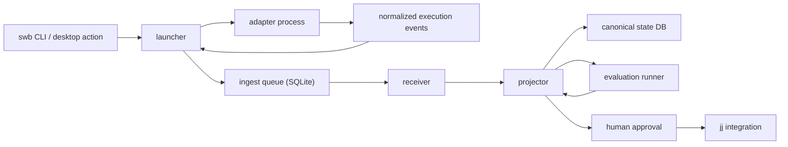

# Stackbench v2 - ARCHITECTURE

Date: 2026-03-16
Status: Active
Depends on: `STACKBENCH_V2_AGENTS.md`, `STACKBENCH_V2_REPO_LAYOUT.md`, `STACKBENCH_V2_CANONICAL_STATE.md`, `STACKBENCH_V2_ADAPTER_CONTRACT.md`, `STACKBENCH_V2_DESKTOP_PLAN.md`

## Purpose
Define the current v2 architecture for the local runtime, canonical state path, evaluation flow, and desktop workbench integration.

Supporting runtime specs:
- `STACKBENCH_V2_CANONICAL_STATE.md`
- `STACKBENCH_V2_GSTACK_SPEC.md`
- `STACKBENCH_V2_ADAPTER_CONTRACT.md`
- `STACKBENCH_V2_PERSONA_PROFILE_MAPPING.md`
- `STACKBENCH_V2_EVAL_LEASE_RUNTIME.md`
- `STACKBENCH_V2_DESKTOP_PLAN.md`

## Canonical Flow

## Architectural Decisions
- The runtime is local-first.
- The `swb` CLI is the canonical operator interface.
- The desktop app uses the same machine-readable runtime contracts.
- The launcher is the only writer into the ingest path.
- Adapters emit normalized events and artifacts only.
- The ingest queue is SQLite-backed in the current implementation.
- The receiver and projector own canonical state progression.
- `jj` is the primary workspace and integration model.

## Ingest Queue Contract
The `ingest queue` is the first durable boundary.

Required behavior:
- accept launcher-owned envelopes only
- durably persist accepted work before success is returned
- preserve deterministic replay order
- support crash-safe restart and replay
- support idempotent application into canonical state

Acknowledgment rule:
- `swb run start` returns success after durable enqueue
- the returned `run_id` is stable
- execution may begin after the command returns

Current implementation:
- `swb-queue-sqlite` persists accepted work
- `swb-receiver` drains queue entries into projection
- `swb-state` stores both derived state and applied timeline history for `swb run logs`

## Adapter Event Contract
An `adapter` never writes task or run state directly.

Minimum envelope:
- `run_id`
- `step_id`
- `adapter`
- `ts`
- `kind`
- `payload`

Minimum event classes:
- lifecycle: prepared, launched, completed, failed, cancelled
- stream: stdout, stderr
- notices: warning, error
- artifact: produced files, diff stats, workspace metadata
- summary: exit status, duration, change identifiers

Required adapter capabilities:
- auth status
- login support when available
- streaming support
- cancellation support
- artifact extraction support
- revision or change discovery support

## Receiver Responsibilities
- validate accepted envelopes
- assign stable ingest metadata
- persist accepted entries for replay and audit
- expose deterministic replay order to the projector

The receiver does not own provider logic or UI concerns.

## Projector Responsibilities
- derive canonical task and run state
- record evaluation, approval, and integration state
- persist applied timeline entries
- expose replay-safe reads for status, list, and logs

Current run progression:
- `draft`
- `queued`
- `running`
- `evaluating`
- `awaiting_review`
- `approved` or `rejected`
- `integrated` or `archived`
- `failed` and `cancelled`

## Evaluation And Approval Flow
After adapter execution completes:
1. the launcher emits completion into the ingest queue
2. the projector marks the run ready for evaluation
3. repository-defined evaluation commands run in the run workspace
4. evaluation completion is written into the canonical timeline
5. failed evaluation moves the run to `failed`
6. passing evaluation moves the run to `awaiting_review`
7. a human operator approves or rejects
8. only approved runs may integrate through `jj`

## Desktop Integration Rules
The Electron workbench is an operator shell.

Rules:
- desktop does not own state
- desktop does not bypass the ingest queue
- desktop does not scrape human-only output where JSON exists
- auth status and login actions use the same adapter contract exposed to terminal users
- watch mode is owned by the main process and tied to a repo root

## Workspace And Integration Model
Each runnable step receives an isolated `jj` workspace.

Current expectations:
- successful execution produces an inspectable `jj` change
- approval happens before integration
- integration operates on `jj` changes or bookmarks
- patch export and PR automation are downstream work, not core architecture

## Future Transport Note
The default receiver is local and queue-backed.

Possible later transports:
- local HTTP/API receiver
- remote launcher or agent receiver
- external broker-backed ingestion

Those additions must preserve:
- launcher-only canonical writes
- normalized event envelopes
- receiver and projector semantics
- durable enqueue before acknowledgment

## Selective Reuse In The Current Repo
Useful concepts now live in the retained v2 runtime:
- normalized domain envelopes in `swb-core`
- durable append and replay discipline in `swb-queue-sqlite`
- auth doctor and login flows in `swb-adapters`
- `jj` integration guardrails in `scripts/swb-jj.sh`

## Explicit Exclusions
Stackbench v2 does not carry these as core architecture:
- direct adapter writes into canonical state
- tmux-first orchestration
- browser-first control surfaces
- a monolithic server crate owning orchestration, projection, and UI-facing behavior
